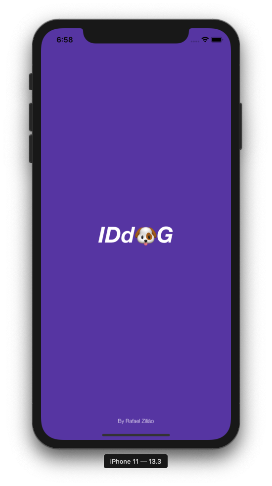
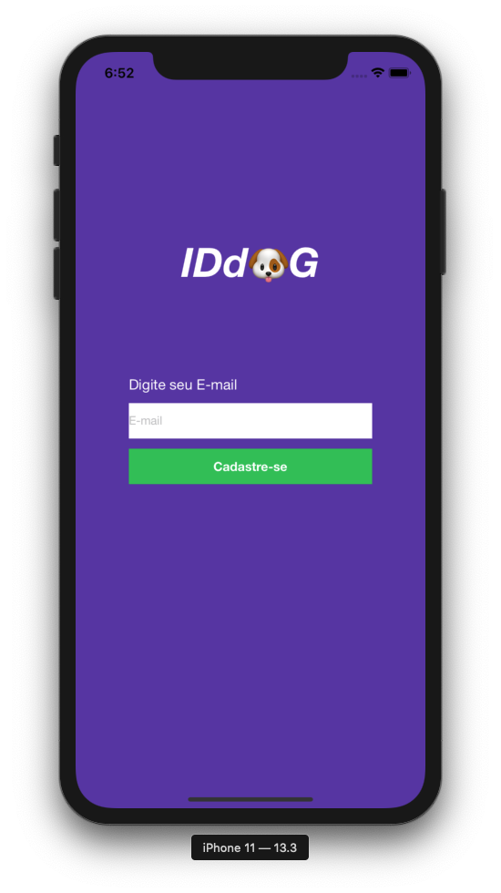
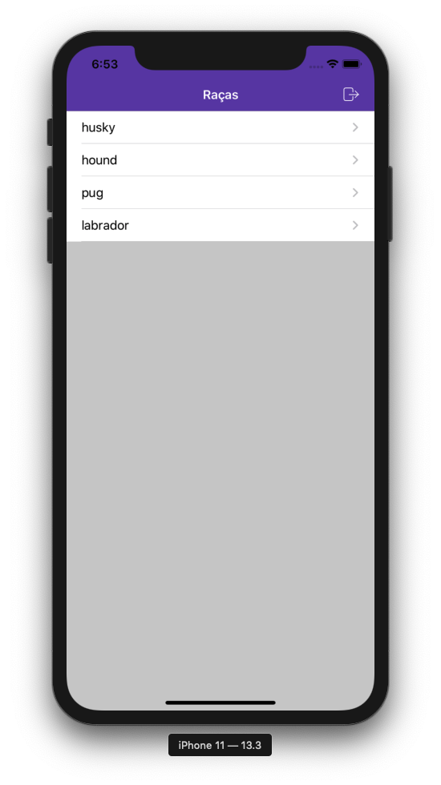
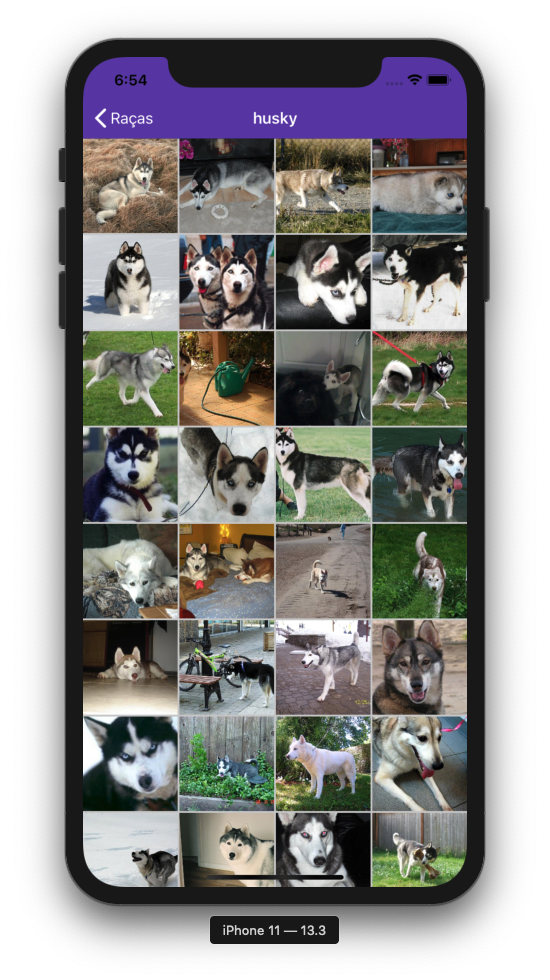
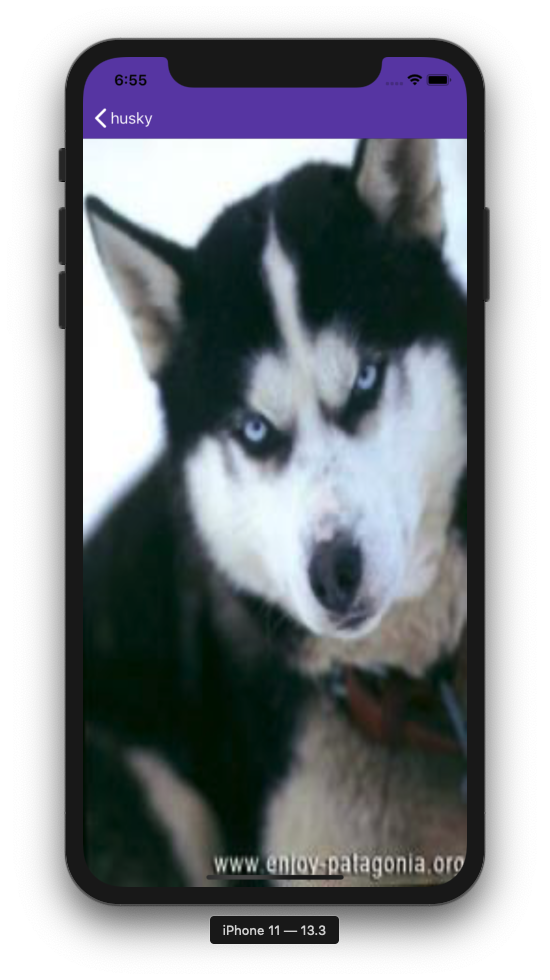

# IDd🐶g


Um aplicativo iOS que mostra fotos de diferentes raças de cachorro.

---

## Screenshots

<p align="center">
  
  
  
  
  
</p>

## Requisitos

1. Xcode 11.3.1
2. Swift 5.0
3. iOS 11.0 

`OBS:` Nos requesitos para o desenvolvimento do app foi solicitado iOS 9.0, eu o considero muito antigo e um tanto trabalhoso manter suporte para uma versao tão antiga, ainda mais levando em consideração iOS 13, darkmode além de algumas novas funcionalidades. <br/>Tenho trabalhado nesse último ano em projetos de grande porte, como Globo Esporte e Globoplay onde o target minimo é o iOS 11.4

## Por onde começar
1. Clone esse repositório
2. Rode o script `./setup.sh`
3. Abra o arquivo `.xcworkspace`
4. Rode o projeto 🚀

`OBS 1:` Esse projeto usa o [xUnique](https://github.com/truebit/xUnique) uma dependência do Python que serve para manter o arquivo `.pbxproj` organizado, então lembre-se de commitar os arquivos alterados por ele.

`OBS 2:` Esse projeto usa o [blundler](https://bundler.io/) para o controle de gems como cocoapods, fastlane, slather, então caso queira instalar os pods ou atualiza-los faça através do comando `bundle exec pod ...`

## Arquitetura

Esse aplicativo segue o [**VIP** (Clean Swift Architecture)](https://hackernoon.com/introducing-clean-swift-architecture-vip-770a639ad7bf)

<p align="center">
  
</p>

`OBS:` Os componentes externos que se comunicam com os `Interactors` estão abstraídos em `Workers`

## Módulos
* Commons: Contém Protocols, Extensions, Helpers e Components que são usados em várias partes do projeto
* ImageLoader: Abstração para a biblioteca [Nuke](https://github.com/kean/Nuke) que realiza o download e cache das imagens
* Models: Abstração dos modelos utilizados pelas requests
* Network: Abstração para a realização de requests
* Security: Abstração para a biblioteca [KeychainSwift](https://github.com/evgenyneu/keychain-swift)

`OBS 1:` Os módulos foram criados pensando-se em transforma-los em pequenos frameworks

`OBS 2:` Como não existe na documentação um endpoint que retorna as 4 possíveis raças, considerei inviável a realização de 4 requests, apenas para obter o nome da raça a ser utilizada para retornar a lista de links usada na galeria, sendo assim essa chamada foi feita através de um [mock](https://github.com/rafaelhziliao/iddog/blob/master/iddog/Sources/Scenes/Categories/Worker/CategoriesWorker%2BCategoriesExternalCalls.swift), onde a estrutura retorna o nome da raça e um boolean que representa a existência ou não de fotos.

### Dependências
Todas as dependências do projeto e bibliotecas de terceiros utilizadas nesse projeto e suas respectivas versãos podem ser encontradas em
> Todas as dependências e bibliotecas de terceiros utilizadas nesse projeto e suas respectivas versãos podem ser encontradas em[Podfile](https://github.com/rafaelhziliao/iddog/blob/master/Podfile).

* [**R.swift**](https://github.com/mac-cain13/R.swift) Usado para deixar recursos como imagens, cores e fontes customizadas fortemente tipadas evitando o uso de strings hard coded
* [**SwiftLint**](https://github.com/realm/SwiftLint) Ferramenta para reforçar o estilo Swift e suas convenções
* [**Nuke**](https://github.com/kean/Nuke) Usado para fazer o download e cache das imagens, escolhida pelo seu alto desempenho, recursos, testes, constantes atualizações e credibilidade
* [**KeychainSwift**](https://github.com/evgenyneu/keychain-swift) Usado para persistir dados sensíveis no `Keychain`, escolhido pela sua facilidade de uso e credibilidade

## ✅ Pontos fortes

* [x] Viewcode
* [x] Uso de principios SOLID
* [x] Escalável 
* [x] Muitas partes reutilizáveis
* [x] Testável
* [x] Ficou implícita a implementação de um autologin e este foi implementado
* [x] Fácil para implementar fluxos alternativos, como onboardings e fluxos que exigem ou não autenticação

## ☑️ Para fazer ou melhorar

* [ ] Testes unitários, instrumentados e UI
* [ ] Checagem de conexão `Reachability`
* [ ] Separação de ambientes de desenvolvimento (prod,dev e stg)
* [ ] Criar uma estrutura que encapsula a navegação (por exemplo `Navigator`)
* [ ] Abstrair as scene factories para `protocols`
* [ ] Suportar darkmode

## Tarefa
```
# idwall-mobile-test
Crie um aplicativo para Android (Kotlin ou Java) ou iOS (Swift ou Object C) com as seguintes características:

* Criar uma tela de login onde o usuário precisa digitar um endereço de email válido.
* Armazene localmente o token retornado pela API no login.
* Após o login feito com sucesso, redirecione para uma tela onde deve conter as listas com as imagens
* Crie uma forma para que o usuário possa navegar entre as quatro raças de cachorros (husky, labrador, hound e pug)
* Ao clicar em uma imagem, ela deve ser exibida de forma expandida.

Requisitos técnicos
* Fazer cache das imagens
* Versão mínima: Android API 16 ou iOS 9
* É recomendado o uso de libs de terceiros para:
  * chamadas de rede
  * download e cache das imagens
* O uso de todas as libs deve ser justificado no README.
* Faça um README documentando tópicos que julga importante para quem for avaliar, tais como arquitetura, libs, decisões, como executar o projeto, etc.
* Caso tenha desenvolvido para Android, disponibilize o .apk.
```
